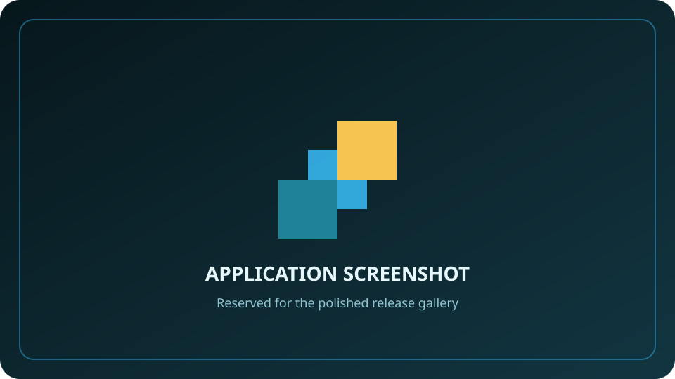
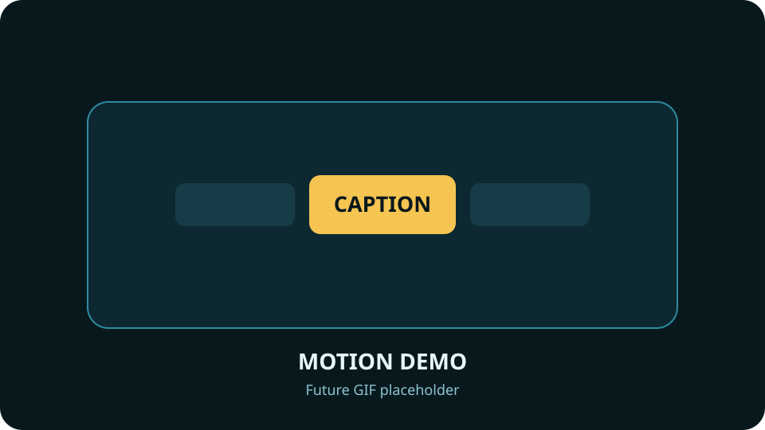
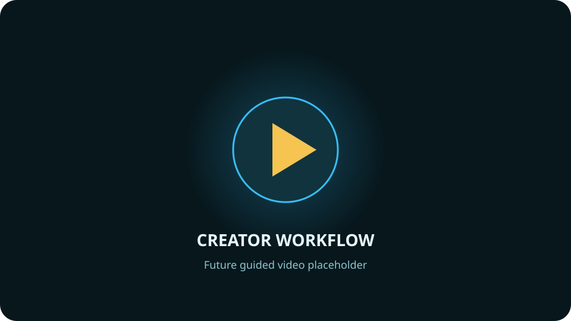

<div align="center">
  
  <h1>Replay Foundry</h1>
  <p><strong>Turn long gameplay recordings into polished vertical clips—locally, deliberately, and under your control.</strong></p>
  <p>
    
    
    
    
  </p>
</div>

Replay Foundry is a Windows desktop workflow for finding strong gameplay moments, shaping vertical videos, styling captions, reviewing titles and descriptions, organizing finished work, and preparing YouTube releases. The application keeps editing and AI processing on the creator's PC; uploads happen only through explicit Publish actions.

> This repository is being polished privately before its public-source launch. Installers, runtime packs, screenshots, and release notes will appear here only after the signed release candidate passes the complete production gate.

## The workflow

| Find | Shape | Finish | Publish |
| --- | --- | --- | --- |
| Review long recordings and surface candidate moments. | Compose vertical layouts, trim timing, mix audio, and style animated captions. | Refine metadata, preview the final render, and keep projects organized locally. | Review every YouTube field before an upload or scheduled release. |

## Preview gallery

| Product tour | Caption motion | Publishing review |
| --- | --- | --- |
|  |  |  |
| Final application screenshots will replace this card. | A short GIF will demonstrate caption and interaction motion. | A guided demo video will show the complete creator workflow. |

## Product principles

- **Local first:** source media, transcripts, project state, and optional local AI stay on the PC unless the user starts an upload or explicitly sends a reviewed report.
- **Review before action:** generation results remain editable; publishing requires a deliberate confirmation.
- **No silent substitutions:** qualified runtimes and models are verified by manifest and hash. Missing or incompatible capabilities are explained instead of replaced with an unknown tool.
- **Recoverable workflows:** projects, renders, and publish drafts are durable, while rebuildable caches can be cleared independently.
- **Accessible motion:** interaction and caption effects respect reduced-motion and high-contrast settings.

## Development

Requirements:

- Windows 10 19041 or newer
- .NET 10 SDK
- PowerShell 7
- Visual Studio 2026 or another Windows desktop build environment

Build and run the model-free verification suites:

```powershell
dotnet build .\ReplayFoundry.slnx -c Debug
dotnet run --project .\ReplayFoundry.InspectionTests\ReplayFoundry.InspectionTests.csproj --no-build -c Debug
dotnet run --project .\ReplayFoundry.CompositionTests\ReplayFoundry.CompositionTests.csproj --no-build -c Debug
dotnet run --project .\ReplayFoundry.PreparationTests\ReplayFoundry.PreparationTests.csproj --no-build -c Debug
dotnet run --project .\ReplayFoundry.RuntimePacks.Tests\ReplayFoundry.RuntimePacks.Tests.csproj --no-build -c Debug
```

Large native runtimes, model weights, generated packs, signing material, credentials, media, and build artifacts are intentionally absent from Git. See [installer/README.md](installer/README.md) for the verified external-payload release flow and [installer/THIRD-PARTY-COMPLIANCE.md](installer/THIRD-PARTY-COMPLIANCE.md) for distribution review status.

## Trust and privacy

Replay Foundry does not embed API secrets or private signing material. Release builds resolve only verified active runtime packs. User reports are sanitized, remain local by default, and are sent only after explicit review and consent. Please report security concerns through the process in [SECURITY.md](SECURITY.md).

## Project status

The source is under active private release preparation. The first public milestone will include a signed Windows installer, reviewed runtime catalogs, final media examples, reproducible release manifests, and public support links.

Copyright © 2026 Expired Soda Studios LLC. Source code is available under the [MIT License](LICENSE.txt); bundled third-party components retain their own licenses and notices.
