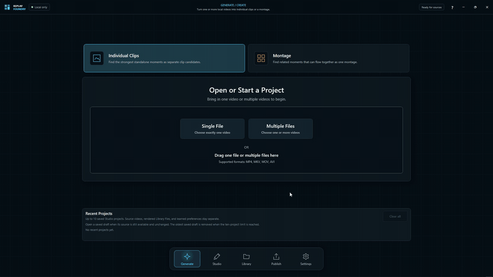
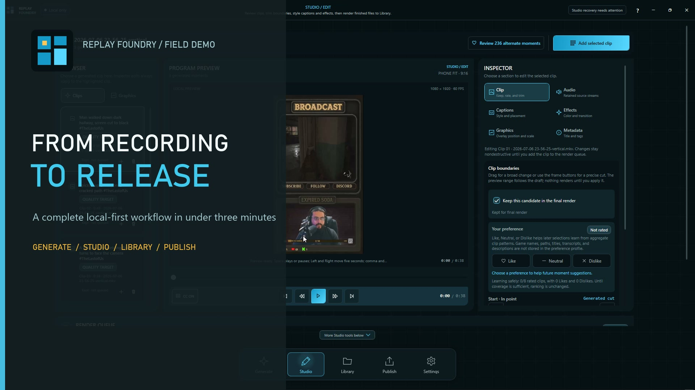
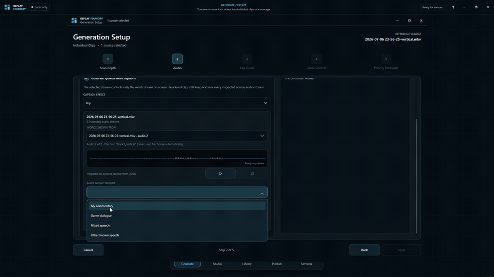
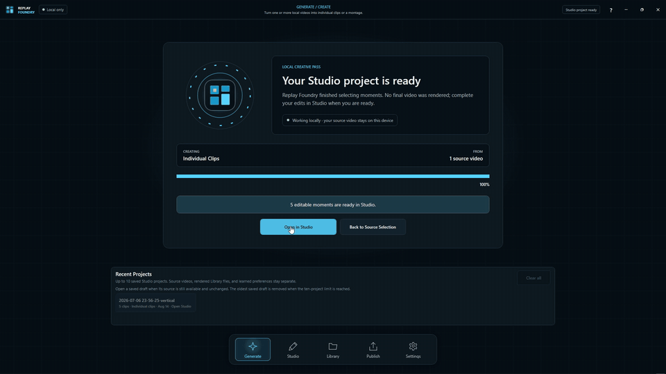
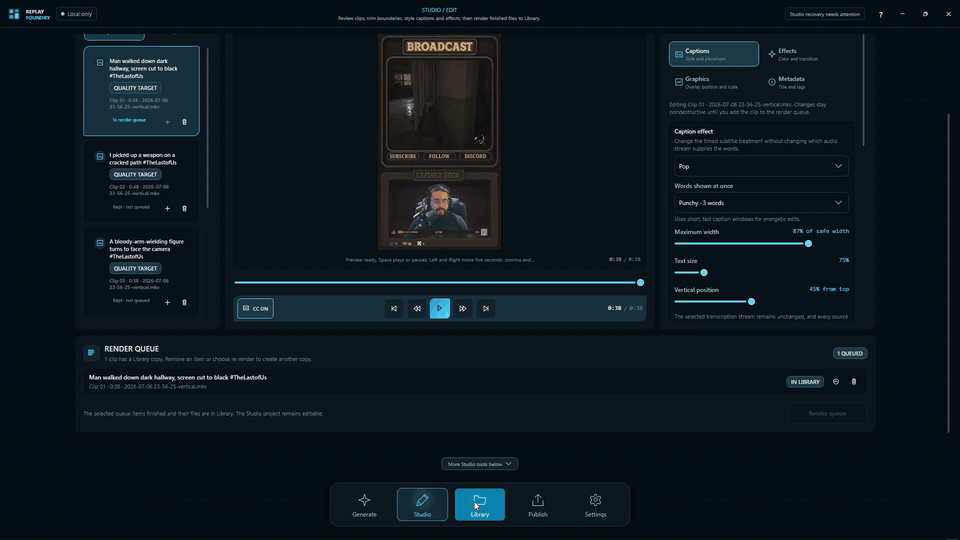
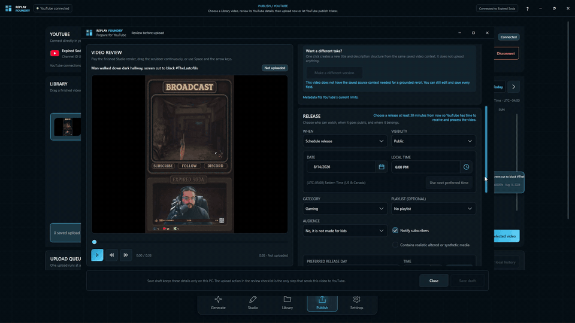
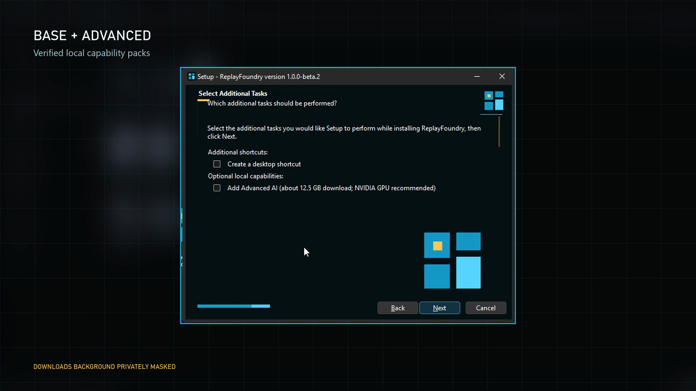

<div align="center">
  
  <h1>Replay Foundry</h1>
  <p><strong>Turn long gameplay recordings into polished vertical clips—locally, deliberately, and under your control.</strong></p>
  <p>
    <a href="https://github.com/ExpiredSoda/ReplayFoundry-Desktop/releases/latest"></a>
    <a href="https://github.com/ExpiredSoda/ReplayFoundry-Desktop/actions/workflows/desktop-ci.yml"></a>
    
    
    
  </p>
  <p>
    <a href="https://replayfoundry.com">Website</a> ·
    <a href="https://github.com/ExpiredSoda/ReplayFoundry-Desktop/releases/tag/v1.0.0-beta.2">Download Beta 2</a> ·
    <a href="https://buymeacoffee.com/expiredsoda">Support development</a>
  </p>
</div>



Replay Foundry is a Windows desktop workflow for finding strong gameplay moments, shaping vertical videos, styling captions, reviewing titles and descriptions, organizing finished work, and preparing YouTube releases. Editing and optional AI processing stay on the creator's PC; uploads happen only through explicit Publish actions.

## Watch the complete workflow

[](https://github.com/ExpiredSoda/ReplayFoundry-Desktop/releases/download/v1.0.0-beta.2/ReplayFoundry-3-Minute-Workflow-Demo-1080p.mp4)

The 2 minute 37 second demo follows the real product from installer choices through Generate, Studio, Library, and a scheduled YouTube release. Long local-analysis intervals are condensed and clearly labeled; the product interactions themselves are shown directly.

## The workflow

| 01 · Generate | 02 · Studio |
| --- | --- |
|  |  |
| Choose a recording, set the gameplay region, and let Replay Foundry surface candidate moments with local analysis. | Review the result, trim timing, compose the frame, mix audio, and style animated captions. |

| 03 · Library | 04 · Publish |
| --- | --- |
|  |  |
| Keep finished videos and project context organized on the PC. | Review every field, connect YouTube deliberately, and upload now or schedule a release. |

## Install the beta

Download the Microsoft-signed [Replay Foundry Beta 2 installer](https://github.com/ExpiredSoda/ReplayFoundry-Desktop/releases/download/v1.0.0-beta.2/ReplayFoundry-1.0.0-beta.2-Base-win-x64-setup.exe).



- **Base** installs the core local editing, rendering, transcription, Library, and Publish workflow.
- **Advanced AI** is optional. Setup downloads the pinned local visual-analysis runtime and model from Replay Foundry hosting after you choose it. The current package is about 12.5 GB and is intended for compatible NVIDIA systems.
- The installer and runtime catalogs verify signed or hashed release artifacts before use. Large model weights, native runtimes, signing material, and credentials are never stored in this source repository.

This is a prerelease. Back up important work and use the in-app reviewed diagnostics flow when reporting a problem.

## Product principles

- **Local first:** source media, transcripts, project state, and optional local AI stay on the PC unless the user starts an upload or explicitly sends a reviewed report.
- **Review before action:** generated clips and metadata remain editable; publishing requires deliberate confirmation.
- **No silent substitutions:** qualified runtimes and models are verified by manifest and hash. Missing or incompatible capabilities are explained instead of replaced with an unknown tool.
- **Recoverable workflows:** projects, renders, and publish drafts are durable, while rebuildable caches can be cleared independently.
- **Accessible motion:** interaction and caption effects respect reduced-motion and high-contrast settings.

## Build from source

Requirements:

- Windows 10 version 19041 or newer
- .NET 10 SDK
- PowerShell 7
- Visual Studio 2026 or another Windows desktop build environment

```powershell
dotnet build .\ReplayFoundry.slnx -c Debug
dotnet run --project .\ReplayFoundry.InspectionTests\ReplayFoundry.InspectionTests.csproj --no-build -c Debug
dotnet run --project .\ReplayFoundry.CompositionTests\ReplayFoundry.CompositionTests.csproj --no-build -c Debug
dotnet run --project .\ReplayFoundry.PreparationTests\ReplayFoundry.PreparationTests.csproj --no-build -c Debug
dotnet run --project .\ReplayFoundry.RuntimePacks.Tests\ReplayFoundry.RuntimePacks.Tests.csproj --no-build -c Debug
```

See [installer/README.md](installer/README.md) for the verified external-payload release flow and [installer/THIRD-PARTY-COMPLIANCE.md](installer/THIRD-PARTY-COMPLIANCE.md) for third-party distribution details.

## Trust, privacy, and support

Replay Foundry does not embed API secrets or private signing material. Release builds resolve only verified active runtime packs. User reports are sanitized, remain local by default, and are sent only after explicit review and consent. Please report security concerns through [SECURITY.md](SECURITY.md).

Replay Foundry is free to download. If it saves you time and you want to help fund continued development, [support Expired Soda on Buy Me a Coffee](https://buymeacoffee.com/expiredsoda). Support is optional and never changes product access.

<div align="center">
  <a href="https://buymeacoffee.com/expiredsoda">
    
  </a>
  <br />
  <sub>Scan the code or click it to open the optional support page.</sub>
</div>

Copyright © 2026 Expired Soda Studios LLC. Source code is available under the [MIT License](LICENSE.txt); bundled third-party components retain their own licenses and notices.
